# Serverless Leopard Speech-to-Text Engine

Do you need a service that transcribes multiple small audio files over a period of time? Or have you repeatedly been calling a cloud service continuously for transcription but have seen your cost grow unconditionally?

In this tutorial, we show how to set up your own serverless Speech-to-Text transcription service using Leopard, API Gateway, and Amazon Lambda. In a few minutes, you have your serverless Leopard transcription service up and running for your needs.

## Pre-requisites

Register for an [AWS](https://aws.amazon.com/account/) account. We will be using it to access AWS Lambda and API Gateway services either via the console or CLI.

Sign up for [Picovoice Console](https://console.picovoice.ai/) using GitHub and to get your AccessKey for free. We will need an AccessKey to use Leopard Speech-to-Text engine.

## Estimated Cost

Suppose for a specific use case you need to transcribe 100 audio files per hour, each file being 15 seconds in length. Processing a 15-second file in a lambda takes roughly around 3000ms. Expected cost excluding **free tier** (operating in us-west-2):

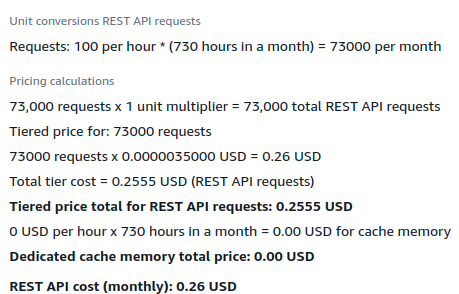
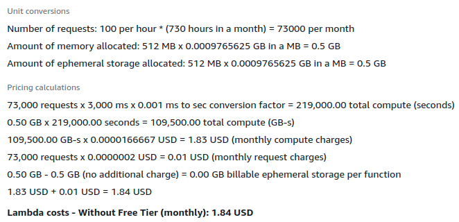

Estimated cost is roughly 0.26$ + 1.84$ = 2.1$ (usd) per month.

Estimate cost for your service: [API Gateway](https://calculator.aws/#/createCalculator/APIGateway), [Lambda](https://calculator.aws/#/createCalculator/Lambda)

## Limitations

API Gateway has a 29-second timeout and 10MB payload size limit. Lambda has a 15-minute timeout and a 6MB payload size limit. 

Considering the lower bound limitations (29-second timeout and 6MB file size), the audio size must be less than 4.5MB (audio file is base64 encoded) and less than 2 minutes to transcribe successfully before a timeout occurs.

## High-Level Overview

1. Download the zip file from [GitHub Repository](serverless_leopard.zip). Create a Lambda function and upload the zip.
2. Update timeout and memory limit for your needs. Add the `ACCESS_KEY` environment variable with your from [Picovoice Console](https://console.picovoice.ai/)
3. Create an API in API Gateway and give it a post method. Tick the `Proxy Integration` on and set your Lambda function ARN as well.
4. Add `multipart/form-data` in `Settings > Binary Media Types`.
5. Deploy API.

## Step-by-step Instructions

### Setting up Lambda

1. In AWS Console, go to `Lambda`, and go to `Functions` tab.

    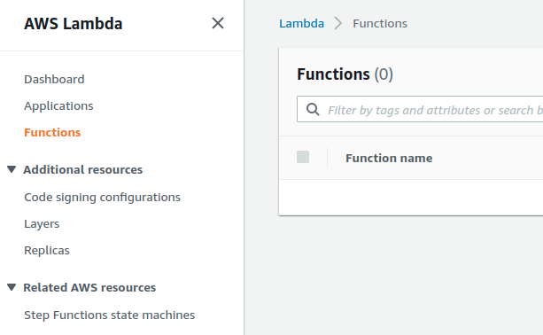

2. Press `Create a Function`. Then set the function name and set the runtime to Python 3.9.

    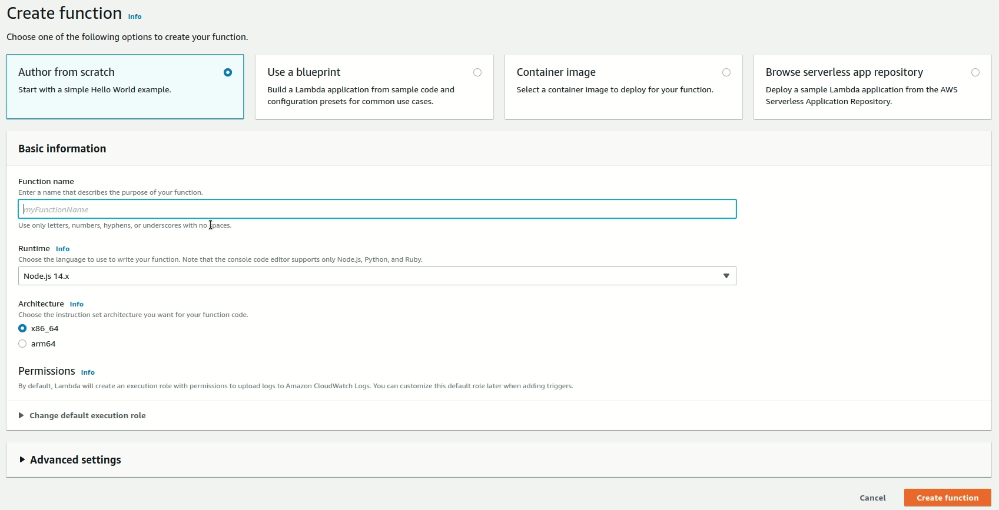                                                        

3. Download the zip file from the [GitHub repository](serverless_leopard.zip) which contains the Lambda handler ([source](serverless_leopard/lambda_function.py)) and packaged [pvleopard module](https://pypi.org/project/pvleopard/). 

    The Lambda handler does the following:
      1. Gets and parses the form-data from the request.
      2. Saves the audio data into a temporary file.
      3. Transcribes and cleans up the temporary file.
      4. Returns the transcription

4. Press on `Upload from > .zip file` and upload the zip file.

    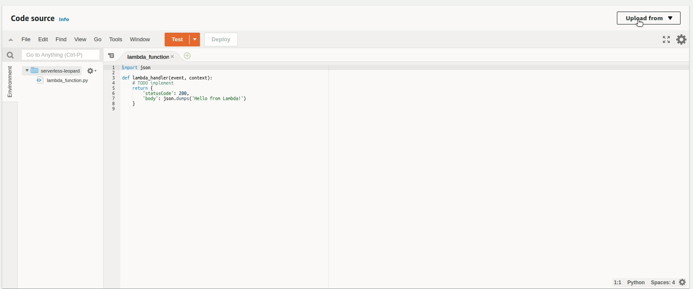

5. Once the function is uploaded, go to `Configurations > General configuration` tab. Press on `Edit`.

    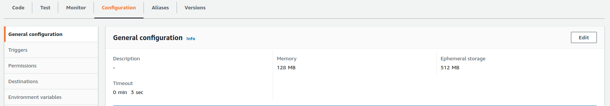

6. Set the memory limit to `512 MB` and timeout to `15 minutes` and press `Save`.

    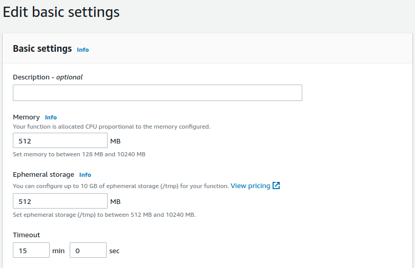

7. Go to `Environment variables` tab and press on `Edit`. 

    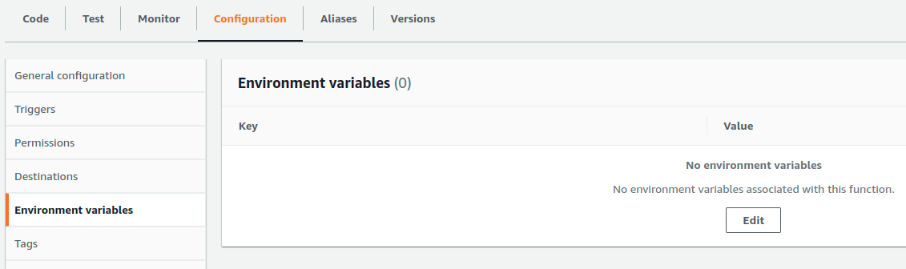

8. Add your `AccessKey` that you obtained from [Picovoice Console](https://console.picovoice.ai/) and press `Save`.

    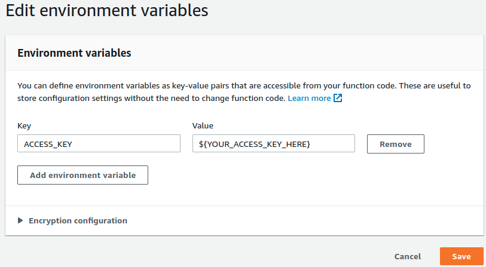

9. Press on `Copy ARN` (button located in the top right corner) and save your function ARN. We will need to set up API Gateway later. You may also come back later to copy your function ARN.

    

### Setting up API Gateway

1. In AWS Console, go to `API Gateway`, and go to `REST API` section. Press on `Build` to create a new Rest API.

    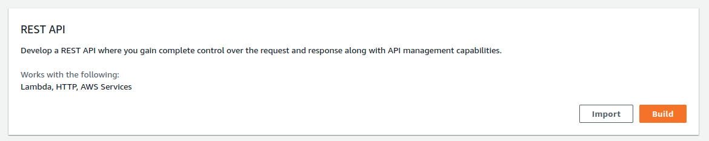

2. Select `Rest` as the protocol, `New API`, and give a name to your API. Press `Create API` to create your API.

    

3. Press `Actions > Create Method` and select `POST` as your method. Select `Lambda Function` as the integration type, tick on `Proxy Integration`, and copy your Lambda function ARN saved from before.

    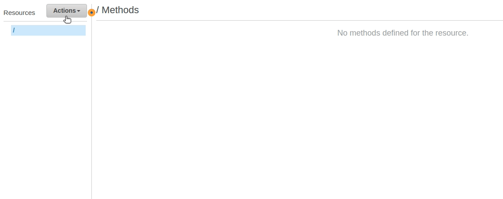

4. Once created, go to `Settings` tab.

    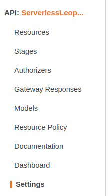

5. Scroll all the way down. In `Binary Media Types` press on `Add Binary Media Type`, add `multipart/form-data` and press on `Save Changes`.

    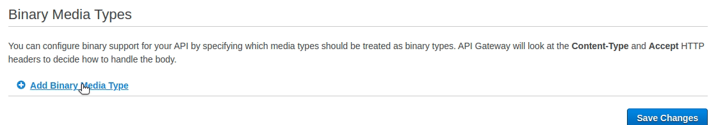

6. Go back to `Resources` tab. Press on `Actions > Deploy API`. Set `[New Stage]` as the deployment stage, give it a stage name and press `Deploy`.

    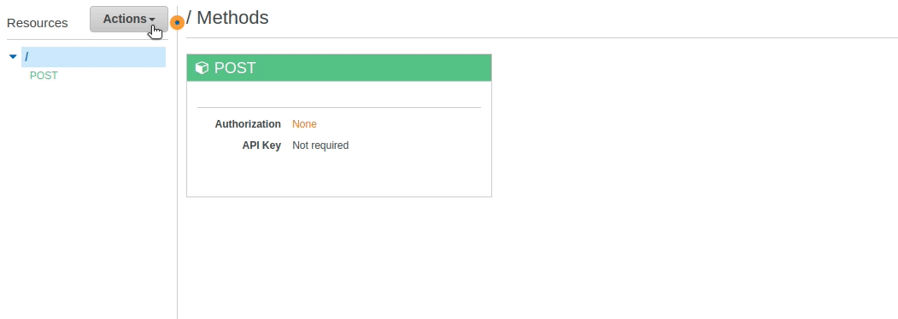

You will be redirected to `Stages` and your API URL will be shown. Now we can test the Rest API.

## Testing the API

We will use [Postman](https://www.postman.com/downloads/) to send an audio file and get the transcription.

1. Copy and paste the `invoke URL` from API Gateway in the request URL section and set the request type to `POST`.

    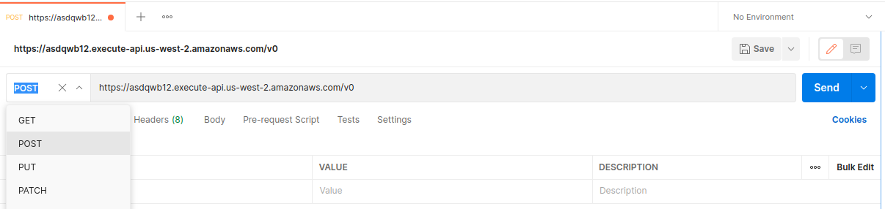

2. In the `Body` tab, set the data type to `form-data`. Set the key name to `audio_file`, set the type as `File`, and press on `Select Files` and select the audio file you want to transcribe (Leopard supports the following audio formats: `FLAC`, `MP3`, `Ogg`, `Opus`, `Vorbis`, `WAV`, and `WebM`).

    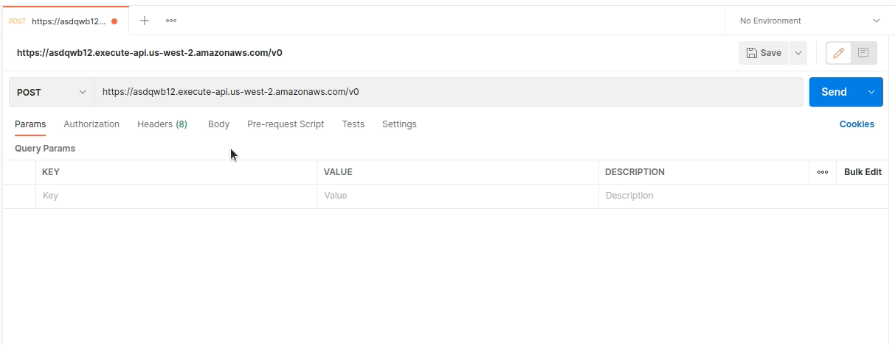

3. Once the request goes through, the result will show below.

    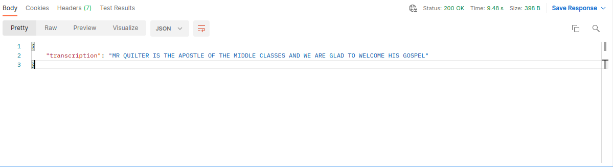

In AWS Console, go to `CloudWatch > Log groups` if you would like more details on a specific API request and Lambda invocation.

## Conclusion

We have seen how to set up Leopard and integrate it with Lambda and API Gateway. Keep in mind this setup is for smaller audio files that require transcription. Since this is a starter code, you can always modify the code, re-zip, and upload the zip file again to update your function.

Finally, take a look at [Leopard GitHub Repository](https://github.com/Picovoice/leopard) or [Leopard Docs Page](https://picovoice.ai/docs/leopard/) to learn more about Leopard.
